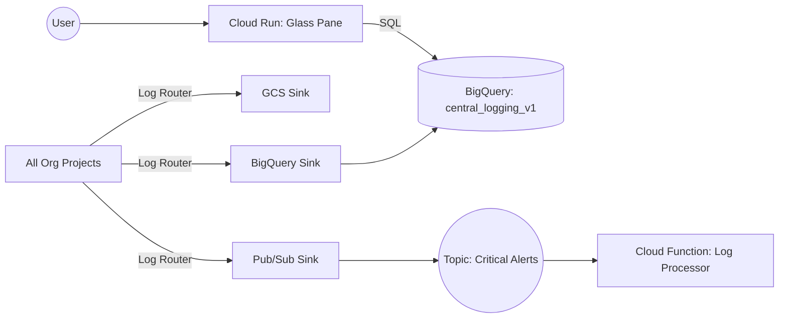

# System Architecture

## Overview
This system provides a centralized logging and visualization platform for Google Cloud Platform (GCP). It aggregates logs from an entire Organization into a central BigQuery dataset and provides a "Glass Pane" web interface for viewing them.

## Data Pipeline

### 1. Ingestion (Hub-and-Spoke)
- **Source:** All logs from all projects in the Organization.
- **Mechanism:** Organization-level Logging Sinks.
- **Destinations:**
    1.  **BigQuery (`central_logging_v1`)**: Hot storage for analytics and the Glass Pane UI.
    2.  **GCS (`dacvisuals-central-logs-archive-v1`)**: Cold/Archive storage for compliance (1 year retention).
    3.  **Pub/Sub (`logging-critical-alerts`)**: Real-time stream for `severity >= ERROR`.

### 2. Storage Schema (BigQuery)
Logs are routed into tables based on their resource type or log name (e.g., `syslog`, `cloudaudit_googleapis_com_activity`).
- **Challenge:** Different log sources have different schemas for `jsonPayload`.
- **Current Solution:** The query layer casts `jsonPayload` to `STRING` to avoid "Field mismatch" errors when unioning tables.

### 3. Query Layer (Glass Pane)
The "Glass Pane" is a Python Flask application running on Cloud Run.
- **Dynamic Discovery:** It queries `INFORMATION_SCHEMA.TABLES` to find *all* active tables in the `central_logging_v1` dataset.
- **Unified View:** It constructs a dynamic `UNION ALL` SQL query to fetch the latest 50 logs across all found tables.
- **Latency:** BigQuery streaming ingestion has a typical latency of few seconds to a few minutes.

## Component Diagram

## Security Assumptions
- The Glass Pane service account has `roles/bigquery.dataViewer` (or `jobUser` + `dataViewer`) on the central dataset.
- The web UI is currently `allow-unauthenticated` for demo purposes (see `deploy_scaffold.sh`), but should be protected by IAP in production.
