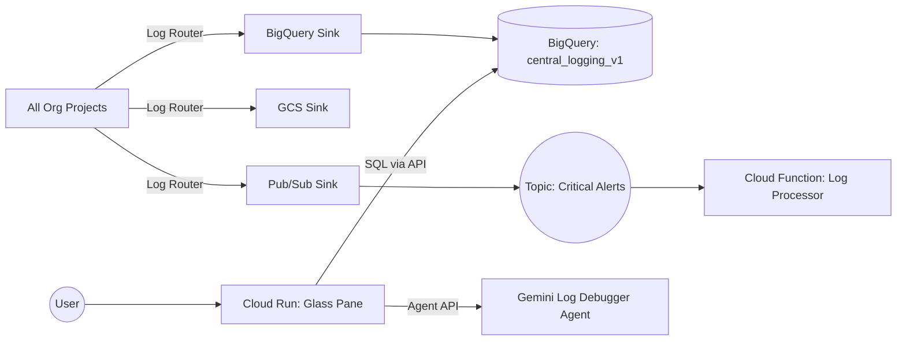

# System Architecture

## Overview
This system provides a centralized logging and visualization platform for Google Cloud Platform (GCP). It aggregates logs from an entire Organization into a central BigQuery dataset and provides a "Glass Pane" web interface for viewing them.

## Data Pipeline

### 1. Ingestion (Hub-and-Spoke)
- **Source:** All logs from all projects in the Organization.
- **Mechanism:** Organization-level Logging Sinks.
- **Destinations:**
    1.  **BigQuery (`central_logging_v1`)**: Hot storage for analytics and the Glass Pane UI.
    2.  **GCS (`dacvisuals-central-logs-archive-v1`)**: Cold/Archive storage for compliance (1 year retention).
    3.  **Pub/Sub (`logging-critical-alerts`)**: Real-time stream for `severity >= ERROR`.

### 2. Storage Schema (BigQuery)
Logs are routed into tables based on their resource type or log name (e.g., `syslog`, `cloudaudit_googleapis_com_activity`).
- **Strategy:** Partitioned Tables (`--use-partitioned-tables`) for performance.
- **Canonical View:** A BigQuery View `view_canonical_logs` unifies these tables into a single schema (`event_ts`, `severity`, `service`, `message`, `json_payload_str`) to simplify querying.

### 3. Query Layer (Glass Pane)
The "Glass Pane" is a Python FastAPI application running on Cloud Run.
- **Canonical View Usage:** Queries a canonical BigQuery view (e.g. `org_observability.logs_canonical_v2`) for log retrieval, simplifying UI/backend logic.
- **API Endpoints:**
    - `GET /api/logs`: Fetches paginated, filterable log entries.
    - `GET /api/logs/:id`: (Future) Fetches a single log entry by ID.
    - `GET /api/facets`: (Future) Fetches aggregated facet data (e.g., unique services, severities).
    - `GET /api/tail`: (Future) Server-Sent Events (SSE) for near real-time log tailing.
    - `POST /api/chat`: Interacts with the Gemini Log Debugger Agent for AI-assisted log analysis.

## Component Diagram

## Gemini Log Debugger Agent
- **Framework:** Built using LangChain and LangGraph.
- **Functionality:** Provides AI-assisted analysis of log entries via the `/api/chat` endpoint.
- **Safety:** Redacts sensitive information, enforces context window limits, and requires explicit confirmation for controlled actions.

## Security Assumptions
- The Glass Pane service account has `roles/bigquery.dataViewer` (or `jobUser` + `dataViewer`) on the central dataset.
- The web UI is currently `allow-unauthenticated` for demo purposes (see `deploy_scaffold.sh`), but should be protected by IAP in production.