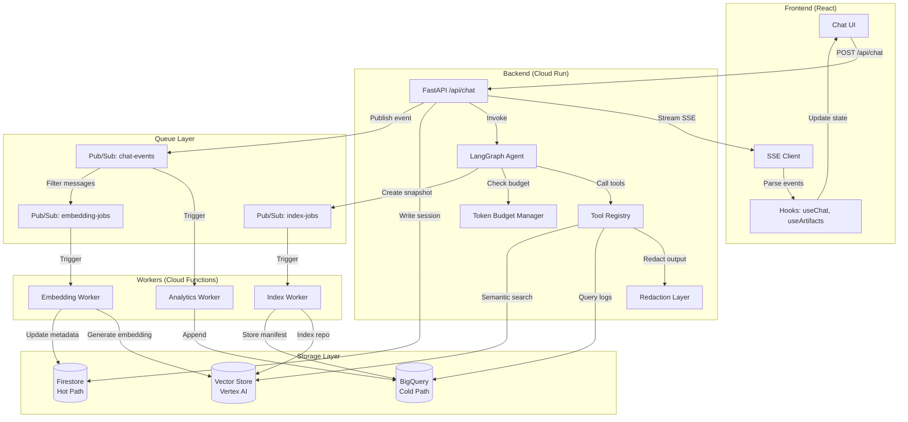
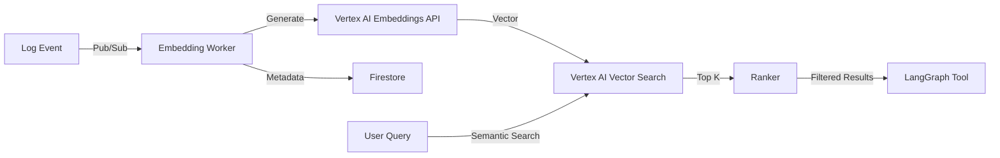

# Reference Architecture - AI Log Intelligence Stack

**Date:** 2025-12-15  
**Status:** Proposed  
**Version:** 1.0

---

## Executive Summary

This document defines the target architecture for Glass Pane's AI intelligence stack, supporting:
- **Realtime chat** with SSE streaming + token budgeting
- **Dual-write storage** (Firebase hot + BigQuery cold)
- **Vector search** with realtime embeddings
- **Queue-based workers** for heavy operations
- **Artifact system** for traces, snapshots, reports
- **MCP tool generator** for safe, auditable tool creation

**Design Principles:**
1. **Incremental adoption** - Build on existing SSE/LangGraph foundation
2. **Cost-conscious** - Partition/cluster BigQuery, cache embeddings, rate-limit tools
3. **Observable** - Every decision, tool call, and token logged
4. **Secure** - Redaction, least privilege, audit trails
5. **Scalable** - Queue heavy work, stream light work

---

## Architecture Diagram



---

## Component Specifications

### 1. Realtime Chat Protocol (SSE)

**Current State:** Working SSE implementation  
**Enhancements:** Add structured event schema, token tracking, checkpoints

#### Event Schema (Extended)

```typescript
type ChatStreamEvent = 
  // Existing events
  | { type: "session", data: { session_id: string } }
  | { type: "on_chat_model_stream", data: { content: string } }
  | { type: "on_tool_start", data: { tool: string, input: any } }
  | { type: "on_tool_end", data: { output: any, duration_ms: number } }
  | { type: "error", data: { message: string, reference_id: string } }
  
  // New events
  | { type: "token_count", data: { 
      input_tokens: number, 
      output_tokens: number, 
      total_tokens: number,
      budget_remaining: number 
    }}
  | { type: "checkpoint", data: { 
      checkpoint_id: string, 
      phase: string, 
      state_summary: string 
    }}
  | { type: "artifact_created", data: { 
      artifact_id: string, 
      type: "trace" | "snapshot" | "report",
      uri: string 
    }}
  | { type: "citation", data: { 
      source: string, 
      excerpt: string, 
      relevance_score: number 
    }}
  | { type: "thought", data: { 
      phase: string, 
      reasoning: string 
    }}
  | { type: "done", data: { 
      total_duration_ms: number, 
      total_tokens: number, 
      total_cost_usd: number 
    }}
```

#### Reconnection Policy

```typescript
class SSEClient {
  private reconnectAttempts = 0
  private maxReconnectAttempts = 5
  private reconnectDelay = 1000 // ms, exponential backoff
  
  async connect(url: string, onEvent: (event: ChatStreamEvent) => void) {
    try {
      for await (const event of streamChat(request)) {
        onEvent(event)
        this.reconnectAttempts = 0 // Reset on success
      }
    } catch (error) {
      if (this.reconnectAttempts < this.maxReconnectAttempts) {
        await sleep(this.reconnectDelay * Math.pow(2, this.reconnectAttempts))
        this.reconnectAttempts++
        return this.connect(url, onEvent)
      }
      throw error
    }
  }
}
```

**Why:** SSE is simpler than WebSocket for unidirectional streaming, works with Cloud Run, and has built-in reconnection in browsers.

**Tradeoffs:** No bidirectional communication (use POST for user input), no binary data (base64 encode if needed).

**Minimum Viable:** Keep existing SSE, add `token_count` and `done` events first.

---

### 2. Dual-Write Storage Strategy

**Pattern:** Write to both Firestore (hot) and BigQuery (cold) for different use cases.

#### Firestore (Hot Path)
**Use Cases:**
- Realtime chat UI (sub-second reads)
- Session history (last 30 days)
- User preferences and saved queries
- Optimistic UI updates

**Collections:**
```
sessions/{sessionId}
  - userId, title, status, createdAt, updatedAt
  - metadata: { totalMessages, totalTokens, totalCost }

sessions/{sessionId}/messages/{messageId}
  - role, content, timestamp
  - metadata: { tokens, tools_used, duration_ms }

sessions/{sessionId}/checkpoints/{checkpointId}
  - phase, state, timestamp

embeddings/{embeddingId}
  - vector: number[] (for client-side caching only, not full vector)
  - metadata: { text_hash, model, created_at }
  - pointer: { vector_store_id, namespace }

artifacts/{artifactId}
  - type, uri, content_hash, created_at
  - session_id, user_id
```

**Retention:** 30 days active, 90 days archived, then delete (or export to GCS)

#### BigQuery (Cold Path)
**Use Cases:**
- Analytics and reporting
- Audit logs (immutable)
- Cost analysis
- ML training data
- Long-term retention (7 years)

**Tables:**

**chat_events** (append-only event log)
```sql
CREATE TABLE chat_events (
  event_id STRING NOT NULL,
  event_type STRING NOT NULL,  -- session_created, message_sent, tool_called, etc.
  event_timestamp TIMESTAMP NOT NULL,
  session_id STRING,
  user_id STRING,
  conversation_id STRING,  -- For grouping related sessions
  
  -- Event payload (JSON)
  payload JSON,
  
  -- Metadata
  source STRING,  -- frontend, backend, worker
  version STRING,  -- app version
  
  -- Cost tracking
  tokens_input INT64,
  tokens_output INT64,
  cost_usd NUMERIC(10, 6)
)
PARTITION BY DATE(event_timestamp)
CLUSTER BY session_id, user_id, event_type
OPTIONS(
  partition_expiration_days=2555,  -- 7 years
  require_partition_filter=true
);
```

**tool_invocations** (tool execution metrics)
```sql
CREATE TABLE tool_invocations (
  invocation_id STRING NOT NULL,
  session_id STRING,
  tool_name STRING NOT NULL,
  
  -- Execution
  started_at TIMESTAMP NOT NULL,
  completed_at TIMESTAMP,
  duration_ms INT64,
  status STRING,  -- success, error, timeout
  
  -- Input/Output (redacted)
  input_hash STRING,  -- SHA256 of input for dedupe
  input_summary STRING,  -- First 500 chars
  output_summary STRING,
  error_message STRING,
  
  -- Cost
  bytes_processed INT64,
  rows_returned INT64,
  cost_usd NUMERIC(10, 6)
)
PARTITION BY DATE(started_at)
CLUSTER BY tool_name, status, session_id
OPTIONS(
  partition_expiration_days=365,
  require_partition_filter=true
);
```

**artifacts** (generated outputs)
```sql
CREATE TABLE artifacts (
  artifact_id STRING NOT NULL,
  session_id STRING,
  user_id STRING,
  
  -- Type and location
  artifact_type STRING,  -- trace, snapshot, report, dashboard_spec
  storage_uri STRING,  -- gs://bucket/path or firestore://collection/doc
  content_hash STRING,  -- SHA256 for dedupe
  
  -- Metadata
  created_at TIMESTAMP NOT NULL,
  size_bytes INT64,
  mime_type STRING,
  
  -- Searchable content
  title STRING,
  description STRING,
  tags ARRAY<STRING>
)
PARTITION BY DATE(created_at)
CLUSTER BY artifact_type, user_id
OPTIONS(
  partition_expiration_days=2555
);
```

**repo_snapshots** (code index metadata)
```sql
CREATE TABLE repo_snapshots (
  snapshot_id STRING NOT NULL,
  repo_id STRING NOT NULL,
  commit_hash STRING NOT NULL,
  
  -- Index metadata
  created_at TIMESTAMP NOT NULL,
  embedding_model STRING,
  embedding_version STRING,
  
  -- Manifest
  file_count INT64,
  total_size_bytes INT64,
  manifest_uri STRING,  -- gs://bucket/manifests/{snapshot_id}.json
  
  -- Vector store pointer
  vector_namespace STRING,
  vector_index_id STRING
)
PARTITION BY DATE(created_at)
CLUSTER BY repo_id, commit_hash
OPTIONS(
  partition_expiration_days=365
);
```

#### Dual-Write Implementation

```python
# src/services/dual_write_service.py
from google.cloud import firestore, bigquery, pubsub_v1
import json
from datetime import datetime
from typing import Dict, Any

class DualWriteService:
    def __init__(self):
        self.fs = firestore.Client()
        self.bq = bigquery.Client()
        self.pubsub = pubsub_v1.PublisherClient()
        self.topic_path = self.pubsub.topic_path("diatonic-ai-gcp", "chat-events")
    
    async def write_message(
        self,
        session_id: str,
        role: str,
        content: str,
        metadata: Dict[str, Any]
    ):
        """Write message to both Firestore and BigQuery (via Pub/Sub)"""
        message_id = generate_id()
        timestamp = datetime.utcnow()
        
        # 1. Write to Firestore (hot path, synchronous)
        message_ref = (
            self.fs.collection("sessions")
            .document(session_id)
            .collection("messages")
            .document(message_id)
        )
        message_ref.set({
            "role": role,
            "content": content,
            "timestamp": timestamp,
            "metadata": metadata
        })
        
        # 2. Publish to Pub/Sub (cold path, asynchronous)
        event = {
            "event_id": generate_id(),
            "event_type": "message_sent",
            "event_timestamp": timestamp.isoformat(),
            "session_id": session_id,
            "payload": {
                "message_id": message_id,
                "role": role,
                "content": content[:1000],  # Truncate for BQ
                "metadata": metadata
            },
            "tokens_input": metadata.get("tokens_input", 0),
            "tokens_output": metadata.get("tokens_output", 0),
            "cost_usd": metadata.get("cost_usd", 0.0)
        }
        
        self.pubsub.publish(
            self.topic_path,
            json.dumps(event).encode("utf-8"),
            event_type="message_sent",
            session_id=session_id
        )
        
        return message_id
```

**Why Pub/Sub instead of direct BQ write:**
- Decouples hot path (Firestore) from cold path (BigQuery)
- Allows batching and retry logic in worker
- Enables fan-out to multiple consumers (analytics, ML pipeline)
- Prevents BigQuery quota errors from blocking chat

**Tradeoffs:**
- Eventual consistency (BQ lags Firestore by ~seconds)
- Additional Pub/Sub cost (~$0.40 per million messages)
- More complex debugging (need to trace through queue)

**Minimum Viable:**
- Keep Firestore writes synchronous
- Add Pub/Sub publish (fire-and-forget)
- Create Cloud Function to consume and write to BQ

---

### 3. Tokenization & Context Budgeting

**Goal:** Prevent context overflow, track costs, enable smart summarization.

#### Token Counter Module

```python
# src/agent/tokenization.py
import tiktoken
from typing import List
from langchain_core.messages import BaseMessage

class TokenBudgetManager:
    def __init__(self, model: str = "gpt-4", max_tokens: int = 1_000_000):
        # Gemini uses similar tokenization to GPT-4
        self.encoding = tiktoken.encoding_for_model("gpt-4")
        self.max_tokens = max_tokens
        self.tokens_used = 0
    
    def count_tokens(self, text: str) -> int:
        return len(self.encoding.encode(text))
    
    def count_messages(self, messages: List[BaseMessage]) -> int:
        total = 0
        for msg in messages:
            total += self.count_tokens(str(msg.content))
            total += 4  # Message overhead
        return total
    
    def check_budget(self, additional_tokens: int) -> bool:
        return (self.tokens_used + additional_tokens) <= self.max_tokens
    
    def reserve_tokens(self, count: int):
        if not self.check_budget(count):
            raise TokenBudgetExceeded(
                f"Would exceed budget: {self.tokens_used + count} > {self.max_tokens}"
            )
        self.tokens_used += count
    
    def get_budget_status(self) -> dict:
        return {
            "tokens_used": self.tokens_used,
            "tokens_remaining": self.max_tokens - self.tokens_used,
            "percent_used": (self.tokens_used / self.max_tokens) * 100
        }
```

#### Integration with LangGraph

```python
# src/agent/state.py (updated)
class AgentState(TypedDict):
    # ... existing fields ...
    token_budget: Dict[str, Any]  # { max, used, remaining }
    token_manager: TokenBudgetManager  # Not serialized

# src/agent/nodes.py (updated)
def diagnose_node(state: AgentState):
    token_mgr = state.get("token_manager")
    messages = state["messages"]
    
    # Check budget before LLM call
    estimated_tokens = token_mgr.count_messages(messages) + 1000  # Reserve for output
    if not token_mgr.check_budget(estimated_tokens):
        # Trigger summarization
        messages = summarize_conversation(messages, token_mgr)
    
    token_mgr.reserve_tokens(estimated_tokens)
    
    res = llm.invoke([sys_msg] + messages)
    
    # Update actual usage
    actual_tokens = token_mgr.count_tokens(res.content)
    token_mgr.tokens_used += actual_tokens
    
    return {
        "messages": [res],
        "token_budget": token_mgr.get_budget_status()
    }
```

#### Chunking Strategy

```python
# src/agent/chunking.py
from typing import List, Dict, Any

def chunk_log_results(
    logs: List[Dict[str, Any]],
    max_tokens_per_chunk: int = 4000
) -> List[str]:
    """Split large log results into token-bounded chunks"""
    chunks = []
    current_chunk = []
    current_tokens = 0
    
    for log in logs:
        log_text = format_log_for_llm(log)
        log_tokens = count_tokens(log_text)
        
        if current_tokens + log_tokens > max_tokens_per_chunk:
            # Flush current chunk
            chunks.append("\n".join(current_chunk))
            current_chunk = [log_text]
            current_tokens = log_tokens
        else:
            current_chunk.append(log_text)
            current_tokens += log_tokens
    
    if current_chunk:
        chunks.append("\n".join(current_chunk))
    
    return chunks

def format_log_for_llm(log: Dict[str, Any]) -> str:
    """Format log entry for LLM consumption (compact)"""
    return (
        f"[{log['event_ts']}] {log['severity']} "
        f"{log['service']}: {log['display_message'][:200]}"
    )
```

**Why tiktoken:** Industry standard, accurate for GPT-4/Gemini, fast.

**Tradeoffs:** Adds ~10ms per request, requires pip install tiktoken.

**Minimum Viable:** Add token counting to SSE events, no enforcement yet.

---

### 4. Vector Search & Embeddings

**Goal:** Semantic search over logs, errors, and code for better context retrieval.

#### Architecture Choice: Vertex AI Vector Search

**Options Evaluated:**
1. **Vertex AI Vector Search** (Recommended)
   - ✅ Fully managed, scales to billions of vectors
   - ✅ Native GCP integration (IAM, VPC, logging)
   - ✅ Supports hybrid search (vector + metadata filters)
   - ❌ Higher cost ($0.30/hour for small index)
   - ❌ More complex setup

2. **Cloud SQL with pgvector**
   - ✅ Lower cost for small datasets
   - ✅ Familiar SQL interface
   - ❌ Manual scaling and maintenance
   - ❌ Limited to ~1M vectors

3. **Qdrant (self-hosted)**
   - ✅ Excellent performance
   - ✅ Rich filtering
   - ❌ Requires GKE or Compute Engine
   - ❌ Operational overhead

**Decision:** Start with Vertex AI Vector Search for production-grade reliability.

#### Embedding Pipeline



#### Embedding Worker (Cloud Function)

```python
# functions/workers/generate_embeddings/main.py
import functions_framework
from google.cloud import aiplatform, firestore
from vertexai.language_models import TextEmbeddingModel
import json
import hashlib

@functions_framework.cloud_event
def generate_log_embedding(cloud_event):
    """
    Triggered by Pub/Sub: chat-events topic
    Generates embeddings for ERROR/CRITICAL logs
    """
    db = firestore.Client()
    aiplatform.init(project="diatonic-ai-gcp", location="us-central1")
    
    # Parse event
    event_data = json.loads(cloud_event.data["message"]["data"])
    
    # Filter: only embed errors and user messages
    if event_data.get("event_type") not in ["message_sent", "log_error"]:
        return
    
    payload = event_data.get("payload", {})
    text = payload.get("content") or payload.get("display_message")
    
    if not text:
        return
    
    # Check if already embedded (dedupe)
    text_hash = hashlib.sha256(text.encode()).hexdigest()
    existing = db.collection("embeddings").where("text_hash", "==", text_hash).limit(1).get()
    if existing:
        print(f"Embedding already exists for hash {text_hash}")
        return
    
    # Generate embedding
    model = TextEmbeddingModel.from_pretrained("text-embedding-004")
    embeddings = model.get_embeddings([text])
    vector = embeddings[0].values
    
    # Store metadata in Firestore
    doc_ref = db.collection("embeddings").document()
    doc_ref.set({
        "text_hash": text_hash,
        "text_preview": text[:500],
        "vector_id": doc_ref.id,
        "model": "text-embedding-004",
        "created_at": firestore.SERVER_TIMESTAMP,
        "metadata": {
            "session_id": event_data.get("session_id"),
            "event_type": event_data.get("event_type"),
            "severity": payload.get("severity"),
            "service": payload.get("service")
        }
    })
    
    # Upsert to Vector Search
    # (Requires Vector Search index to be created first)
    # See: https://cloud.google.com/vertex-ai/docs/vector-search/create-manage-index
    
    print(f"Generated embedding {doc_ref.id} for text hash {text_hash}")
```

#### Semantic Search Tool

```python
# src/agent/tools/vector_search.py
from langchain_core.tools import tool
from google.cloud import aiplatform
from vertexai.language_models import TextEmbeddingModel
from typing import List, Dict, Any

@tool
def semantic_search_logs(
    query: str,
    top_k: int = 10,
    severity_filter: str = None,
    time_range_hours: int = 24
) -> Dict[str, Any]:
    """
    Semantic search over log embeddings.
    Use this to find logs similar to a description, even if keywords don't match.
    
    Args:
        query: Natural language description of what to find
        top_k: Number of results to return
        severity_filter: Optional severity filter (ERROR, WARNING, etc.)
        time_range_hours: Only search logs from last N hours
    """
    # Generate query embedding
    model = TextEmbeddingModel.from_pretrained("text-embedding-004")
    query_embedding = model.get_embeddings([query])[0].values
    
    # Search vector index
    # (Simplified - actual implementation uses Vertex AI Vector Search API)
    index_endpoint = aiplatform.MatchingEngineIndexEndpoint(
        index_endpoint_name="projects/diatonic-ai-gcp/locations/us-central1/indexEndpoints/..."
    )
    
    response = index_endpoint.find_neighbors(
        deployed_index_id="log_embeddings_v1",
        queries=[query_embedding],
        num_neighbors=top_k
    )
    
    # Fetch metadata from Firestore
    results = []
    for neighbor in response[0]:
        doc = db.collection("embeddings").document(neighbor.id).get()
        if doc.exists:
            data = doc.to_dict()
            results.append({
                "text": data["text_preview"],
                "similarity_score": neighbor.distance,
                "metadata": data["metadata"]
            })
    
    return {
        "query": query,
        "results": results,
        "total_found": len(results)
    }
```

**Why Vertex AI Embeddings:** text-embedding-004 is state-of-the-art, multilingual, and cost-effective ($0.00001 per 1K tokens).

**Tradeoffs:** Adds latency (~100ms per embedding), requires quota management.

**Minimum Viable:** Generate embeddings for errors only, store in Firestore, defer Vector Search index creation.

---

## Cost Controls & Guardrails

### BigQuery Cost Controls

```sql
-- Set maximum bytes billed per query
CREATE OR REPLACE VIEW safe_logs AS
SELECT * FROM view_canonical_logs
WHERE DATE(event_ts) >= CURRENT_DATE() - 7  -- Force partition filter
OPTIONS(
  max_staleness=INTERVAL 1 HOUR
);

-- Enforce in Python
job_config = bigquery.QueryJobConfig(
    maximum_bytes_billed=50_000_000_000,  # 50GB
    use_query_cache=True
)
```

### Rate Limiting

```python
# src/services/rate_limiter.py
from google.cloud import firestore
from datetime import datetime, timedelta

class RateLimiter:
    def __init__(self, db: firestore.Client):
        self.db = db
    
    def check_rate_limit(
        self,
        user_id: str,
        action: str,
        limit: int,
        window_seconds: int
    ) -> bool:
        """Check if user has exceeded rate limit"""
        now = datetime.utcnow()
        window_start = now - timedelta(seconds=window_seconds)
        
        # Count recent actions
        query = (
            self.db.collection("rate_limits")
            .where("user_id", "==", user_id)
            .where("action", "==", action)
            .where("timestamp", ">=", window_start)
        )
        
        count = len(list(query.stream()))
        
        if count >= limit:
            return False
        
        # Record this action
        self.db.collection("rate_limits").add({
            "user_id": user_id,
            "action": action,
            "timestamp": now
        })
        
        return True

# Usage in API
@app.post("/api/chat")
async def chat(request: ChatRequest, user_id: str = Depends(get_current_user_uid)):
    if not rate_limiter.check_rate_limit(user_id, "chat_message", limit=100, window_seconds=3600):
        raise HTTPException(429, "Rate limit exceeded: 100 messages per hour")
    # ... rest of handler
```

### Embedding Budget

```python
# Limit embeddings per user per day
MAX_EMBEDDINGS_PER_USER_PER_DAY = 1000

def should_generate_embedding(user_id: str, event_type: str) -> bool:
    # Check daily quota
    today = datetime.utcnow().date()
    count = db.collection("embeddings").where("user_id", "==", user_id).where("date", "==", today).count()
    
    if count >= MAX_EMBEDDINGS_PER_USER_PER_DAY:
        return False
    
    # Only embed high-value events
    return event_type in ["message_sent", "log_error", "log_critical"]
```

---

## Next: Data Models

See `02_langgraph_design.md` for LangGraph enhancements.  
See `03_data_model_firebase.md` for Firestore schema details.  
See `04_data_model_bigquery.md` for BigQuery schema details.

---

**End of Reference Architecture**
