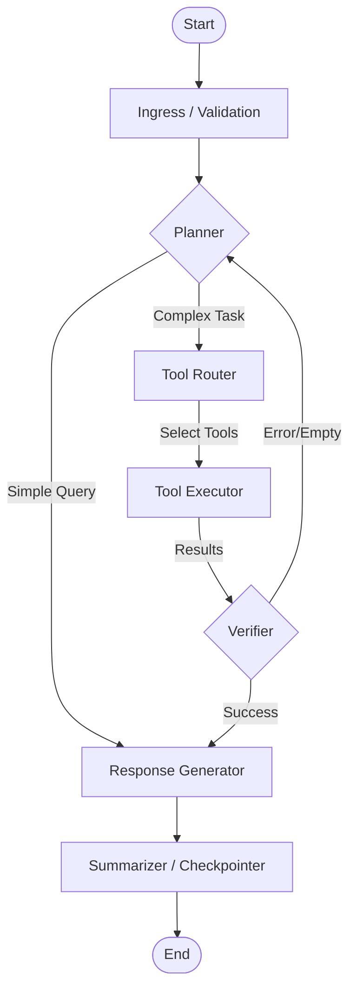

# LangGraph Design

**Date:** 2025-12-15
**Goal:** Define the robust agent orchestration graph.

## 1. Graph Structure

The agent uses a cyclic graph pattern to support dynamic reasoning, tool use, and self-correction.



## 2. Nodes & Responsibilities

### `ingress`
- **Role:** Validate inputs, load user profile, check safety policy.
- **Input:** `messages`, `user_id`.
- **Output:** `safety_check: bool`, `user_context`.

### `planner` (The "Brain")
- **Role:** Analyze conversation history + new message. Decide if tools are needed.
- **Tools:** None (Pure reasoning).
- **Output:** `next_step` (generate | tool_use), `tool_calls`.

### `tool_executor`
- **Role:** Execute selected tools safely.
- **Features:**
  - Parallel execution for independent tools.
  - Timeouts and retries.
  - Result redaction.
- **Output:** `tool_outputs` (List[ToolMessage]).

### `verifier` (Reflector)
- **Role:** Check if tool outputs answer the user's question.
- **Logic:**
  - If results are empty -> Re-plan with different search terms.
  - If error -> Re-plan or ask user for clarification.
  - If good -> Proceed to generation.

### `generator`
- **Role:** Synthesize final response using tool outputs.
- **Streaming:** Tokens are emitted here.

### `summarizer`
- **Role:** Update conversation summary (long-term memory).
- **Action:** Trim context window if too long.

## 3. State Schema (`AgentState`)

```python
from typing import Annotated, List, Dict, Any, Optional
from typing_extensions import TypedDict
from langchain_core.messages import BaseMessage
import operator

class AgentState(TypedDict):
    # Core Chat History
    messages: Annotated[List[BaseMessage], operator.add]
    
    # Metadata
    session_id: str
    user_id: str
    
    # Context
    user_context: Dict[str, Any] # Permissions, preferences
    
    # Internal Graph State
    phase: str # 'plan', 'execute', 'verify', 'generate'
    scratchpad: Dict[str, Any] # Temporary storage for tool results
    retry_count: int
    
    # Metrics
    tokens_used: int
    start_time: float
```

## 4. Streaming Event Protocol

The graph emits events via `astream_events(version="v2")`.

| Event Type | Source Node | Payload | Description |
| :--- | :--- | :--- | :--- |
| `on_chat_model_start` | `planner`, `generator` | `{ "input": ... }` | Model starts thinking. |
| `on_chat_model_stream` | `generator` | `{ "chunk": "..." }` | Response tokens. |
| `on_tool_start` | `tool_executor` | `{ "tool": "bq_query", "input": "..." }` | Tool call initiated. |
| `on_tool_end` | `tool_executor` | `{ "output": "..." }` | Tool finished. |
| `on_custom_event` | `verifier` | `{ "status": "planning_retry" }` | Graph logic updates. |

## 5. Checkpointing Strategy
- **Short-term:** In-memory (during request).
- **Long-term:** Firestore (Session State).
- **Snapshotting:** `LangGraph` checkpointer can use Postgres/Sqlite. We will implement a custom `FirestoreCheckpointer` to persist graph state between turns if we move to async long-running agents.
